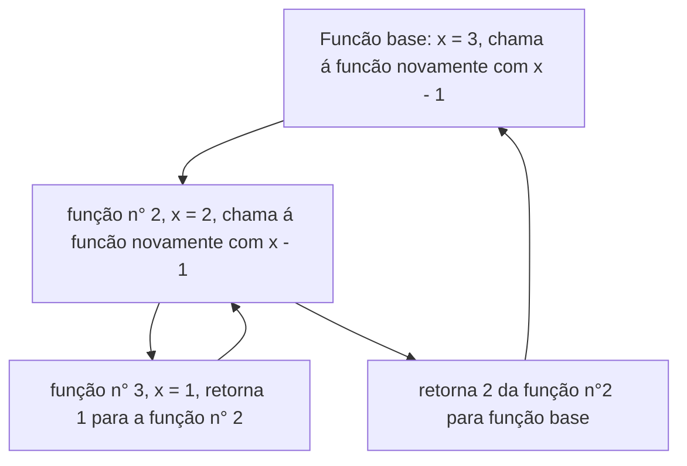

# Recursive Function

Função recursiva é um método onde a função chama a se mesma, tornando-se em um loop, até que tal condição finalize o loop.

**vaja um exemplo de código onde a função recursiva é executada:**
```python
def fat(x):
   if x == 1:
      return 1
   else:
      return x * fat(x - 1)


number =  3
print(f'{number}! = {fat(number)}')
```
nesse código, a função `fat` vai calcular o fatorial de um número. No caso a cima, o número a ser calculado será o número 3. 

> 3! = 3 x 2 x 1 = 6

observe que, a função chama à se mesmas 3x, e cada execução da função a variável **X** é um número diferente até que o **X** seja igual a 1.  

### Mas como funciona a função recursiva debaixo dos panos?

Imagina a função recursiva como blocos que você pode empilhar um em cima do outro. A cada vez que a função se chama, é como se o programa colocasse um novo bloco no top, isso pode acontecer até uma condição finalizar o loop. Assim, quando o loop é finalizado, esse bloco é removido, até chegar na função original ou função base.

No exemplo a cima, onde temos uma função que calcula o fatorial de um número, usando o método de função recursiva. A função base vai verificar se o valor **x** é igual a 1. Se o valor não for igual a 1, a função vai chama a si mesma, so que com uma valor de entrada sendo: x - 1. E vai ficar em um loop até que a condição de x seja igual a 1. Sendo esse X igual a 1, a função irar retornar seus valores. e multiplicar esse retorno com o valor salvo na variável e fazendo esse mesmo processo até chegar na função base. 


**vaja o diagrama do funcionamento da função fat com x = 3:**


